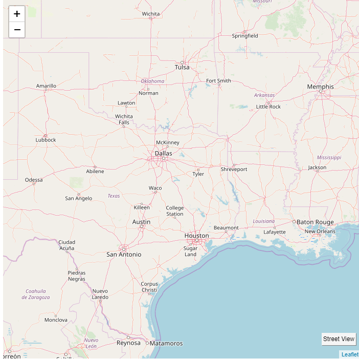

# react-leaflet-street-view

This library will allow user to view panoramic street view by clicking anywhere on map.

It works with any stable version of react-leaflet 1.x.x and 2.x.x.

**How to use :**

**Step 1:** import PanoStreetView from the library
``` javascript
import PanoStreetView from 'react-leaflet-street-view'
```

**Step 2:** Set an object streetView in state.
``` javascript
state = {
  streetView: null
}
```

**Step 3:** Add onClick property in Map Component to update streetView object
``` javascript
<Map 
  center={this.state.center}
  zoom={6}
  onClick={e => this.setState({streetView: e})}
/>
```
**Step 4:** Pass the streetView state object as property in PanoStreetView Component
``` javascript
<PanoStreetView
  streetView={this.state.streetView}
/>
```

**Step 5:** Click on Street View button to enable or disable street View



**Step 6:** Click on any point to open Panoramic Street View in another tab

**Example:**
``` javascript
import React from "react";
import { Map, TileLayer } from "react-leaflet";
import PanoStreetView from "react-leaflet-street-view";

class Main extends React.Component {
  state = {
    streetView: null
  };
  render() {
    return (
        <Map
          onClick={e => this.setState({ streetView: e })}
          style={{ height: "700px", width: "700px", border: "0px" }}
          center={[32, -96]}
          zoom={6}
        >
          <TileLayer url="http://{s}.tile.osm.org/{z}/{x}/{y}.png" />
          <PanoStreetView
            streetView={this.state.streetView}
            position="bottomright"
          />
        </Map>
    );
  }
}
export default Main;

```


**Properties required in PanoStreetView component**

**Property** | **Value** | **Description** | 
------      | --------  | ------ | 
streetView  | this.state.streetView | N/A |
position  | 'topleft' or 'topright' or 'bottomleft' or 'bottomright' |  N/A |
sameWindow | boolean | Opens all street views in same tab if set to true |
